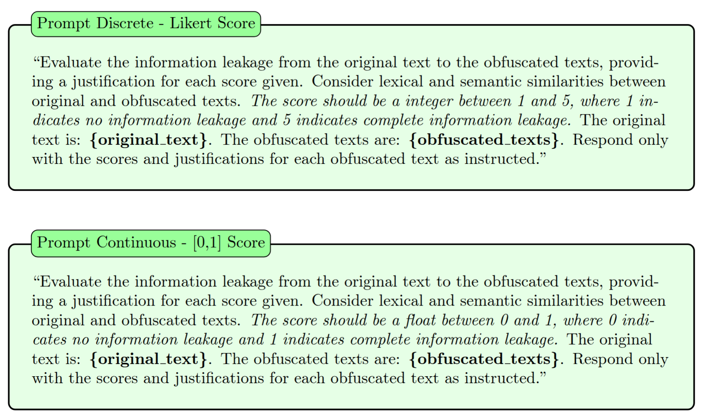
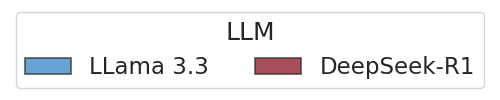
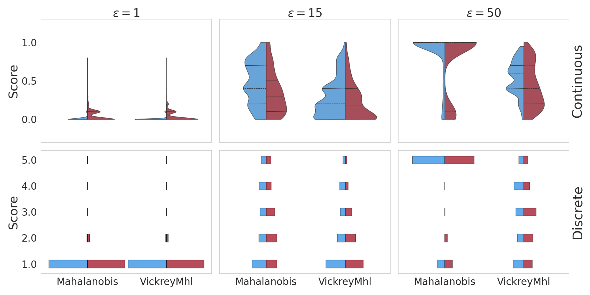
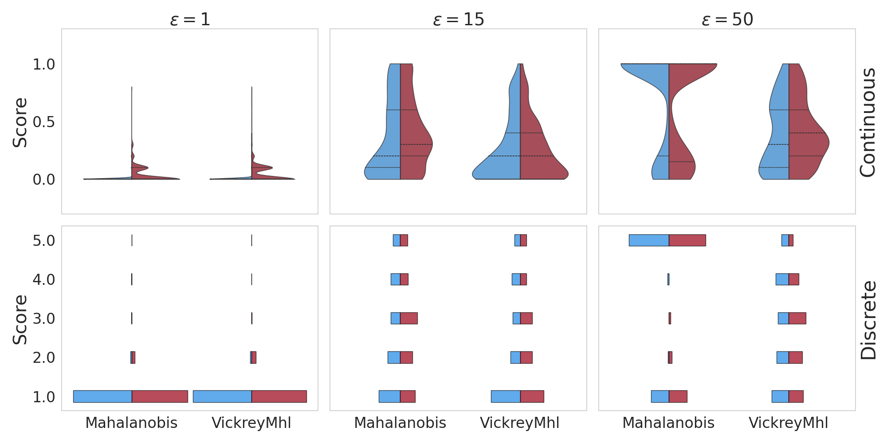

# SIGIR-SP-PrivacyEvalLLMs
Repository for the SIGIR Short Paper (SP) on Assessing Privacy of Obfuscation Mechanisms using LLMs.


<table style="border-collapse: collapse; border: none">
  <tr>
    <td style="border: none; padding-right: 20px; vertical-align: top;">
        <h2>Structure</h2>
      The repository is structured as follows:
      <ul>
        <li><code>appendix/</code>: Contains the appendix of the paper.</li>
        <li><code>config/</code>: Contains the configuration files for the experiments. (To run them you need to generate a conda env from the <code>env.yml</code> file and a cloud key from the <a href="https://console.groq.com/playground">Groq Cloud Platform</a>).</li>
        <li><code>data/</code>: Contains the data used in the experiments. (Query_ID, Original_text, Obfuscated_text, LLM_Score, LLM_Justification, LLM).</li>
        <li><code>results/</code>: Contains the results of the experiments.</li>
        <li><code>src/</code> and <code>demo.py</code>: Contains the code to run the experiments.</li>
      </ul>
    </td>
    <td style="border: none;">
      
    </td>
  </tr>
</table>


## Running the code

To run the code, you need to install the dependencies in the `env.yml` file. You can do this by running the following command:

```bash
conda env create -f env.yml
```
Then, you need to activate the environment:

```bash
conda activate sigir-sp-privacy-eval-llms
```

Finally, you can run the code by running the following command:

```bash
python demo.py
```

Remark: Put the Groq cloud key in the `config/key.txt` file.

## Findings

Prompt Used

<p algn="center">
  
</p>

Distributions of LLM Scores
<p align="center">
  
</p>
<p align="left">
    DeepLearning19
  
</p>
<p align="left">
    Medline04
  
</p>

